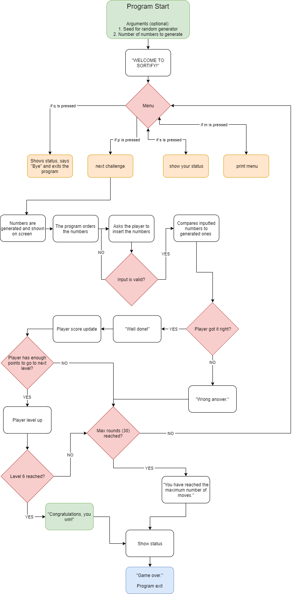

# Relatório Mini-Projeto 1
#### Introdução à Computação
#### Licenciatura em Videojogos - Universidade Lusófona
#### 1º Semestre - 2019/2020

## Grupo
Nome : Doesn't Matter

Autores
* Pedro Marques - 21900800
* Miguel Feliciano - 21904115
* Nelson Milheiro - 21904365

## Descrição da Solução
O programa mostra o menu de opções que o jogador pode escolher quando é inicializado.

Se o jogador carregar no p, o jogo começa normalmente, dando uma lista de números que o jogador tem que ordenar. Se conseguir, o jogador ganha 5 pontos, senão perde e tem que começar de novo. O jogo continua e fica progressivamente mais difícil, até o jogador conseguir chegar ao nível 6, que nesse caso o jogador ganha o jogo. Se o jogador responder com algum número ou letras que não estejam na lista dada, o programa pede para o jogador ordenar os números da lista dada.

Se o jogador carregar no s, o programa mostra em que nível é que o jogador está, os pontos que o jogador tem atualmente e a ronda atual do jogador.

Se o jogador carregar no m, o programa imprime o menu no ecrã outra vez.

Se o jogador carregar no q, o programa fecha com a mensagem "Bye."

## Estrutura do Software

## Conclusões e Matéria Aprendida
Ao fazer este projeto aprendemos a utilizar de forma eficiente todos os conteudos que aprendemos nas aulas e mais. Aprendemos também como o código pode ser escrito de forma mais eficiente o que nos irá ajudar no futuro a desenvolver um código melhor. 

Em conclusão, este exercício serviu para compreendermos melhor a linguagem C e a adquirir vários conhecimentos úteis que certamente iremos utilizar em projetos futuros.

## Bibliotecas Utilizadas
Usamos stdbool.h para termos acesso ao tipo boolean.
